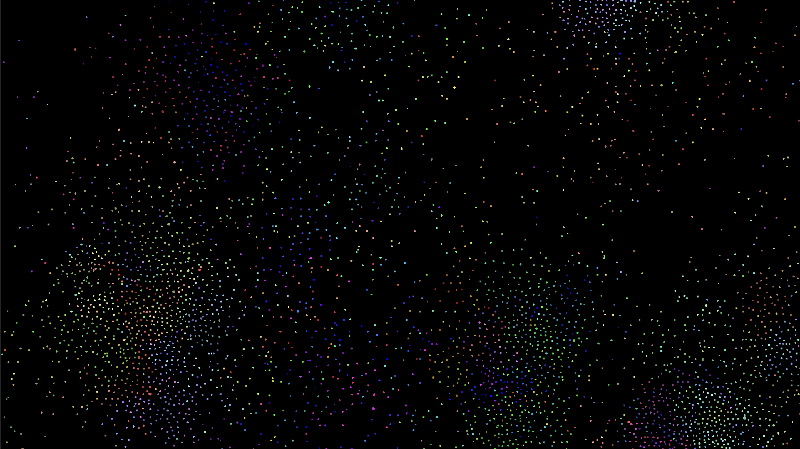
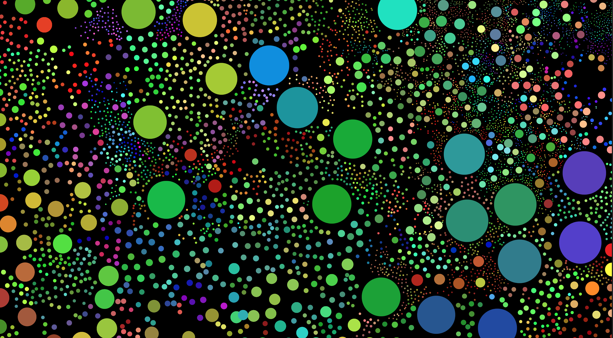
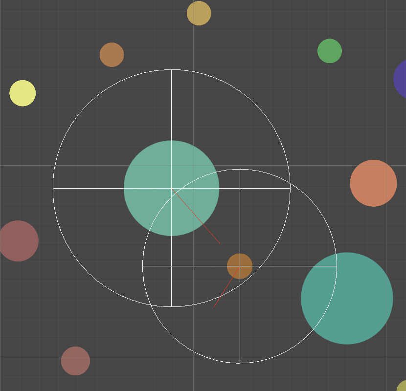

---
# Simulating Natural Selection in Physical Traits and Neural Network-Based Behavior in Ecosystem

  
  

# Table of Contents
[1. Introduction](#Introduction)

[2. Overview](#Overview)

[3. Analysis](#Analysis)

[4. Afterwards](#Afterwards)

# Introduction

This simulation shows how physical and behavioral traits evolve through natural selection.
I was particularly interested in creating an environment that would drive sympatric speciation (where multiple species arise in the same geographical environment).

# Overview
The simulation runs on a uniform environment populated by _creatures_.

## Creatures

A creature has a set size and speed. When a creature is a certain amount larger than another creature, it can consume it to gain energy. The size and speed of a creature are balanced by how quickly it uses energy.

### Representing Resources
In the real world, organisms require energy, which they get through photosynthesizing (autotrophs) or by consuming other organisms (heterotrophs). They also need a source of organic material. In this simulation, the only resource creatures use is "energy," which mimics both material and energy in real life.

Every organism passively generates a small amount of energy, representing photosynthesis. However, the amount of passive energy generation decreases as the population of creatures increases, reflecting the finite amount of material resources in an environment.

$ms^2+Km^.75$ represents the rate at which a creature uses energy, where m is the size, s is the speed, and k is an arbitrary constant. $ms^2$ mirrors the equation of kinetic energy, the energy used by a creature to move. $Km^.75$ reflects _Kleiber's Law_. Kleiber's Law observes that the metabolic rate of a creature increases with its size, but bigger creatures use less energy per mass.

$$\Delta E = G_{autogen} (\frac {N_{max}-n}{N_{max}}) - (ms^2+Km^.75)$$

If a creature is energy positive, it has a positive $\Delta E$. If a creature is energy negative, it must eat other creatures to gain energy. By consuming another creature, a creature gains a percent of the consumed creature's energy. This is around 10% in the real world, but configurable in the simulation. The creature additionally gains energy proportional to its prey's size.

### Behavior

Creatures don't inherently know to chase after smaller creatures or run from larger ones. Instead, their behavior comes from a neural network.

For each neighbor in a `detectRange`, a creature observes its neighbor's color, size, and speed, along with the direction it is moving and the distance between them. It also considers its own energy value and the direction it is currently moving. With these 7 inputs, the neural network goes through several hidden layers and produces a number between -1 and 1, which reflects the creature's intent to move towards or away from its neighbor. The intent for each neighbor is turned into a vector and summed together, with the magnitude of the vector being clamped from 0.5 to 1 (creatures can choose to move as slow as half their max speed to reduce energy cost).

Initially, each weight and bias is set to a random number. Creatures that have higher fitness will produce more similar offspring, which 'trains' the neural network.

### Reproduction and Mutation

When a creature reaches a certain amount of energy, the `spawnThreshold`, it will reproduce. Creatures in this simulation can only reproduce asexually.
A parent will spawn an offspring `spawnDist` units away from its position. Spawning offspring in a further away location reduces competition between the parent and offspring, but has an associated cost in energy.
After reproducing, the parent and offspring will both have an energy value of $\frac {OriginalEnergy} {2} - energyPerSpawnDistance * spawnDistance - splitBaseCost /2$

A newly spawned creature should not be able to immediately reproduce. Creatures have a buffer time from creation, during which they cannot gain energy by consuming other creatures. Without this mechanic, creatures would spawn on top of one another and consume them, instantly reproducing in a recursive cycle.

The magnitude of mutation in all inheritable traits comes from a gaussian-like curve, where most traits remain similar between the offspring and parents, through drastic changes do appear on occasions.

# Analysis

<a href="https://www.youtube.com/watch?v=M0sHzI2oGuQ" target="_blank">Simulation Video (WARNING: may contain rapid visual patterns)<a>

The simulations were run with the settings below for 50 minutes.

The most reliable tactic seemed to be avoiding all other creatures, being energy positive, and passively gaining energy to reproduce. Even though creatures could relatively easily evolve to have the physical traits of a consumer, it was much harder for them to learn the correct behavior. The main problem that had to be overcome was prioritizing the closest creature so that it wasn't being pulled in opposing directions. Another challenge for predators was learning to avoid other predators. Many failed at this, creating territorial predators that limited their population even when ample prey were available.

<!--  -->

Nevertheless, successful populations of consumers arose, driving consumer populations to the brink of extinction near 12:00 and again near 33:00 (though less so). However, reducing the producer population to such levels was unsustainable for the consumers and drove them to extinction, causing a resurgence in producer populations. This cycle seems to happen ~1000 seconds, with smaller fluctuations happening in between. 

 

Producer populations found a stable configuration almost immediately and did not fluctuate over time. The one exception is the increase in their detect radius when their numbers were threatened by the consumers.
In contrast, the ideal traits of consumers seem to depend heavily on the state of the community. Speed, split threshold, and spawn distance seemed to increase as prey populations decreased, suggesting that predators who spent more energy on chasing down prey and spawning offspring further away were more fit when prey were plentiful. However, when food was scarce, the ecosystem couldn't support energy-intensive predators, giving predators that conserved energy a fitness advantage.

 

# Afterwards
Here's some things I still want to do:

## Tuning Global Parameters
The analysis above is done with just one run of the simulation using a specific environment setting. The settings were chosen based on what I though would create an interesting run. For example, I put a low value for the `sizeThresholdToEat` setting, because I wanted to encourage the evolution of consumers. In retrospect, this might have inhibited the predators from learning to avoid each other, as there was a fairly large chance that the interaction between 2 predators would benefit one of them massively. Perhaps if the value was set to 2+, it would push predators of similar sizes to avoid each other, as the outcome would always be mutually detrimental. It is also interesting to note that predators who mostly ate small prey still evolved to be much larger than the minimum threshold to eat. This may have also been caused by the low threshold however: when predators could consume other predators with just a small increase in size (and therefore only a small energy penalty), the size of the predators were driven to increase in an evolutionary arms race within the predator species.

A more thorough investigation that compares the results of multiple simulation runs with varying global variables would be interesting.

## Creatures Should Choose Direction of Movement

Currently, the direction a creature moves in must be a linear combination of the directional vectors between it and its neighbors. If a creature has only one neighbor, it's only choice is to move at some speed either towards or away from it. It would be interesting to let the neural networks independently calculate the direction the creature will move towards, and see if any novel hunting behaviors can emerge (such as pack hunting).

## Identifying Species and Phylogenetic Species

In the observations above, species were divided into 'consumers' and 'producers', which is an oversimplification of the many different creatures that emerged during the simulation. I'd like to collect data on the weights and biases of creatures, as well as their ancestral relationship with one another. This could be analyzed to partition creatures across time, space, and genetic variation into distinct species. Using this, we could look at interactions between different species, instead of wide patterns across all individuals.
