---
# Simulating Natural Selection in Physical Traits and Neural Network-Based Behaviour in Ecosystem

# Table of Contents
1. Introduction
2. Overview
3. Analysis

# Introduction

This simulation shows how physical and behavioural traits evolve through natural selection.
I was particularly interested in creating an environment that would drive sympatric speciation (where multiple species arise in the same geographical environment).

# Overview
The simulation runs on a uniform environment populated by _creatures_.

## Creatures

A creature has a set size and speed. When a creature is a certain amount larger than another creature, it can consume it to gain energy. The size and speed of a creature are balanced by how quickly it uses energy.

### Representing Resources
In the real world, organisms require energy, which they get through photosynthesizing (autotrophs) or by consuming other organisms (heterotrophs). They also need a source of organic material. In this simulation, the only resource creatures use is "energy," which mimics both material and energy in real life.

Every organism passively generates a small amount of energy, representing photosynthesis. However, the amount of passive energy generation decreases as the population of creatures increases, reflecting the finite amount of material resources in an environment.

$ms^2+Km^.75$ represents the rate at which a creature uses energy, where m is the size, s is the speed, and k is an arbitrary constant. $ms^2$ mirrors the equation of kinetic energy, the energy used by a creature to move. $Km^.75$ reflects _Kleiber's Law_. Kleiber's Law observes that the metabolic rate of a creature increases with its size, but bigger creatures use less energy per mass.

$$\Delta E = G_{autogen} (\frac {N_{max}-n}{N_{max}}) - (ms^2+Km^.75)$$

If a creature is energy positive, it has a positive $\Delta E$. If a creature is energy negative, it must eat other creatures to gain energy. By consuming another creature, a creature gains a percent of the consumed creature's energy. This is around 10% in the real world, but configurable in the simulation. The creature additionally gains energy proportional to its prey's size.

### Behaviour

Creatures don't inherently know to chase after smaller creatures or run from larger ones. Instead, their behaviour comes from a neural network.

For each neighbor in a `detectRange`, a creature observes its neighbor's color, size, and speed, along with the direction it is moving and the distance between them. It also considers its own energy value and the direction it is currently moving. With these 7 inputs, the neural network goes through several hidden layers and produces a number between -1 and 1, which reflects the creature's intent to move towards or away from its neighbor. The intent for each neighbor is turned into a vector and summed together, with the magnitude of the vector being clamped from 0.5 to 1 (creatures can choose to move as slow as half their max speed to reduce energy cost).

Initially, each weight and bias is set to a random number. Creatures that have higher fitness will produce more similar offspring, which 'trains' the neural network.

### Reproduction and Mutation

When a creature reaches a certain amount of energy, the `spawnThreshold`, it will reproduce. Creatures in this simulation can only reproduce asexually.
A parent will spawn an offspring `spawnDist` units away from its position. Spawning offspring in a further away location reduces competition between the parent and offspring, but has an associated cost in energy.
After reproducing, the parent and offspring will both have an energy value of $\frac {OriginalEnergy} {2} - energyPerSpawnDistance * spawnDistance - splitBaseCost /2$

A newly spawned creature should not be able to immediately reproduce. Creatures have a buffer time from creation, during which they cannot gain energy by consuming other creatures. Without this mechanic, creatures would spawn on top of one another and consume them, instantly reproducing in a recursive cycle.

The magnitude of mutation in all inheritable traits comes from a gaussian-esque curve, where most traits remain similar between the offspring and parents, through drastic changes do appear on occasions.

# Analysis

<a href="https://www.youtube.com/watch?v=PzugDMRM9Jc" target="_blank">Simulation Video (WARNING: may contain rapid visual patterns<a>

The simulations were run with the settings below for 50 minutes;

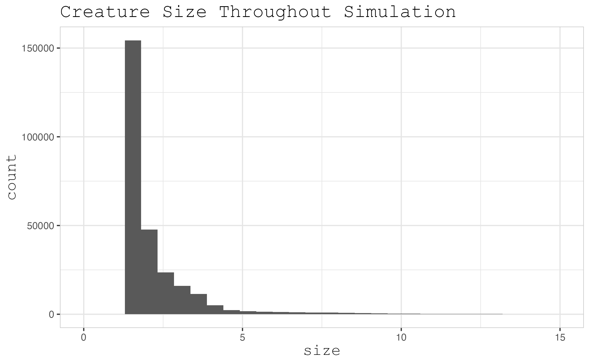

<!-- 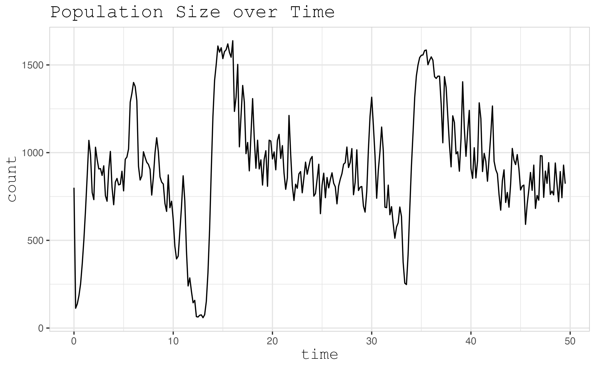 -->
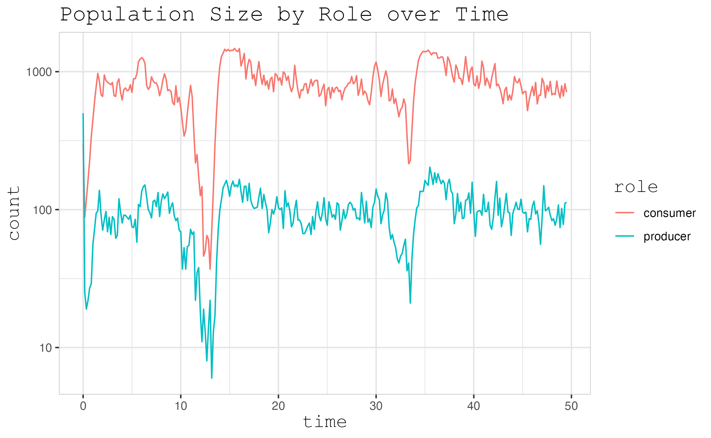
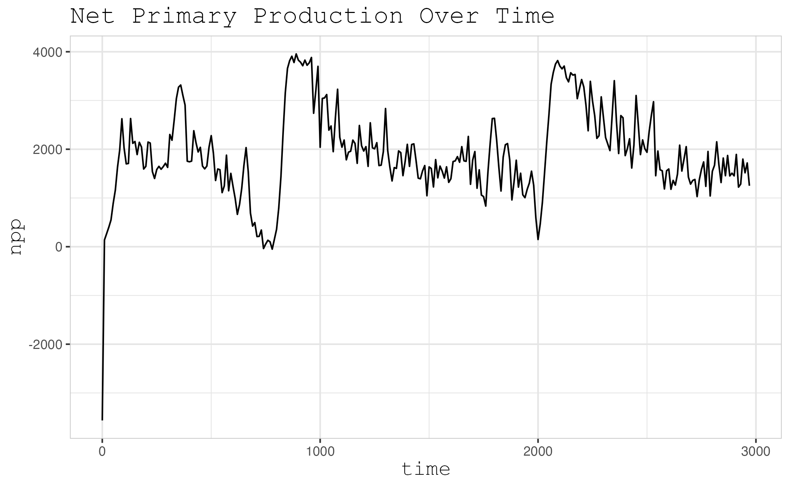

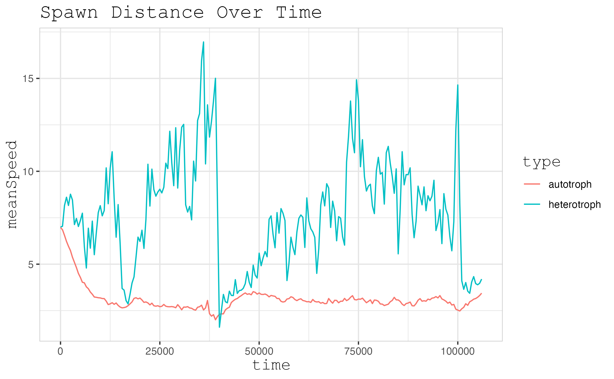 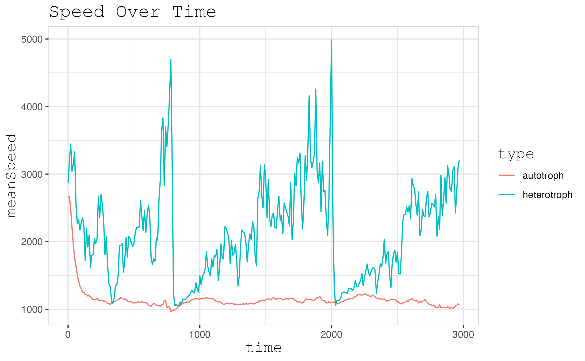
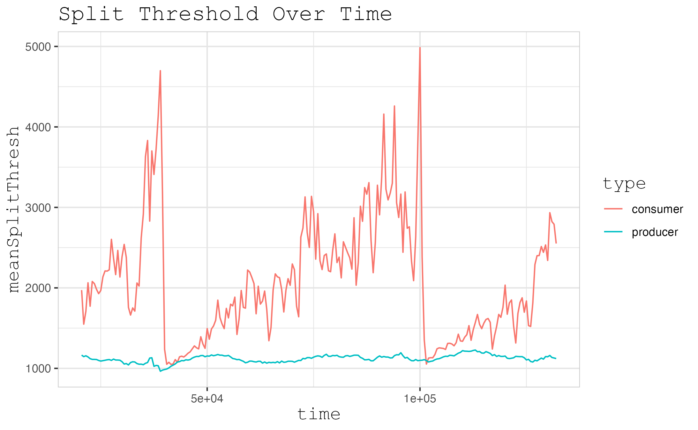
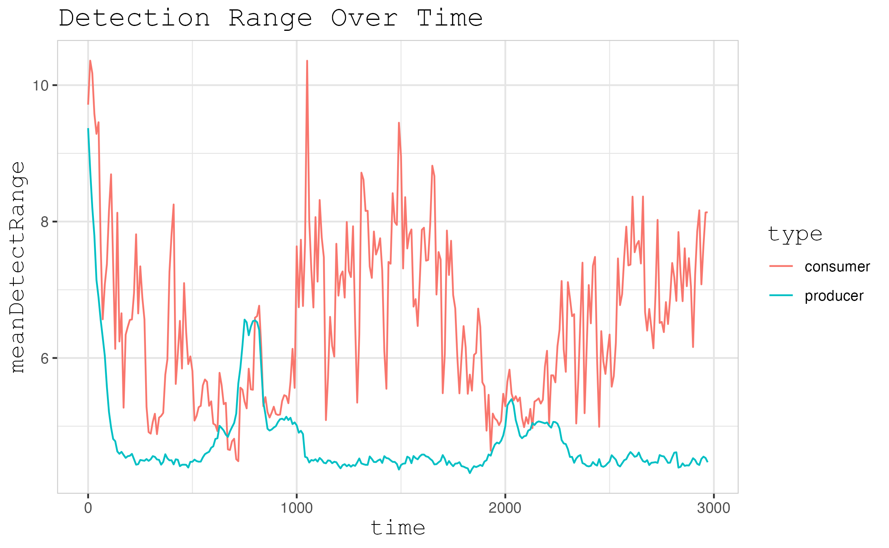

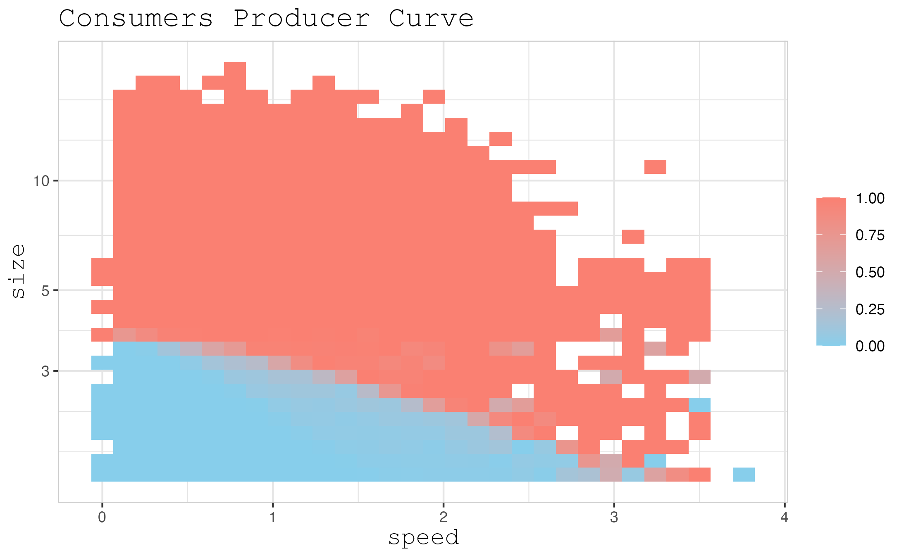 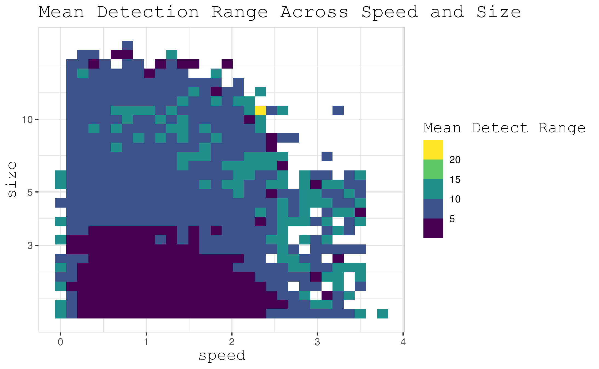
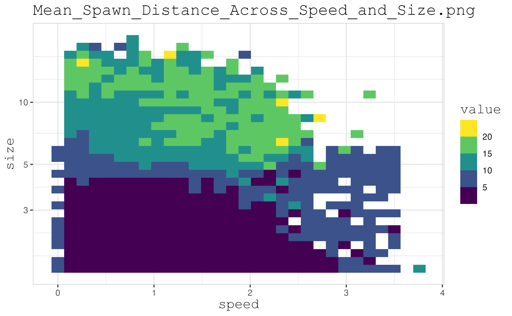
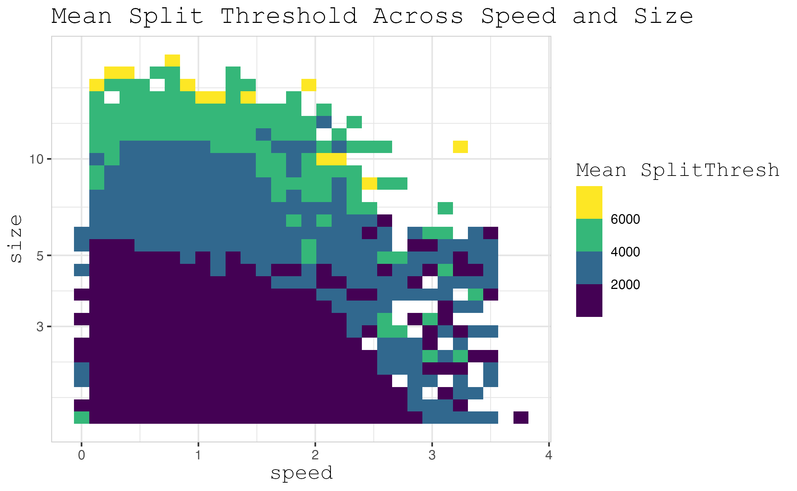

<!--
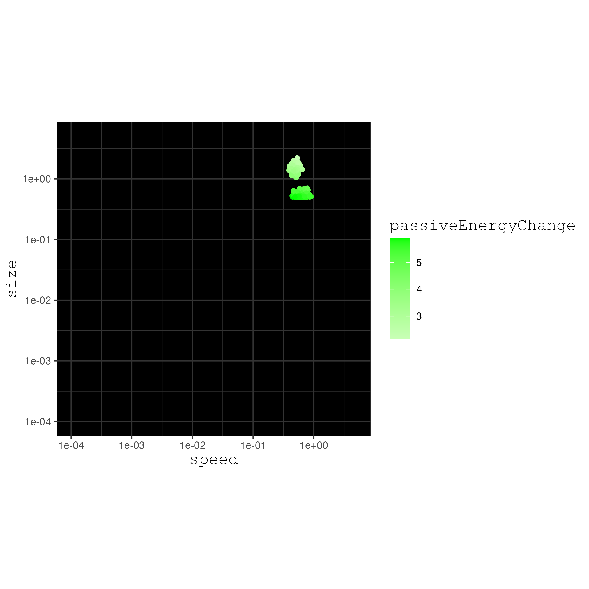

<video width="320" height="240" controls>
  <source src="" type="data_1_18_620.mp4">
  Your browser does not support the video tag.
</video>

https://github.com/user-attachments/assets/3407ade9-2931-4192-b5f9-a9b38d8927f8

